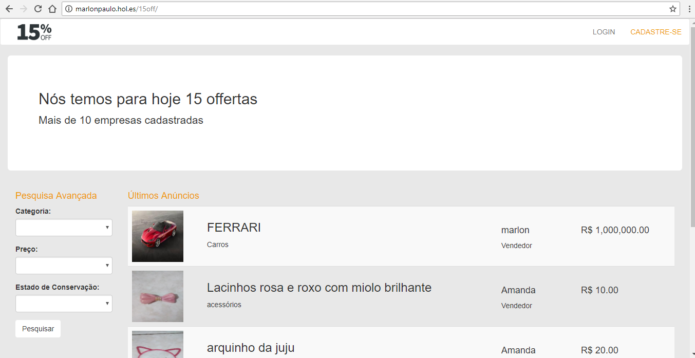
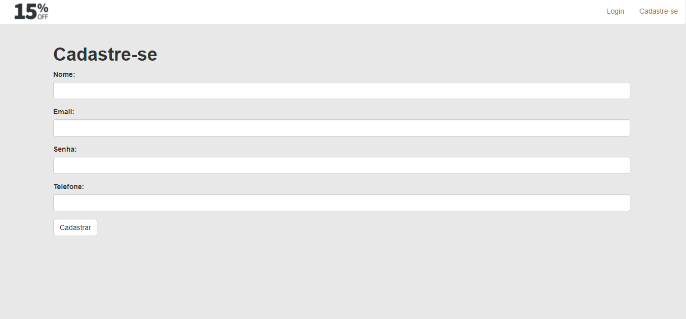
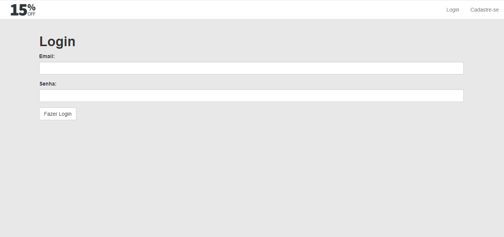
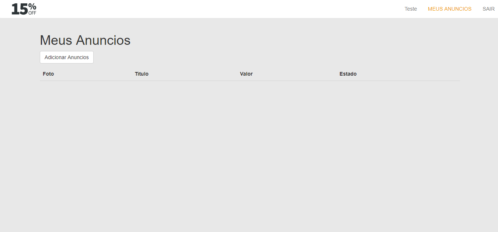
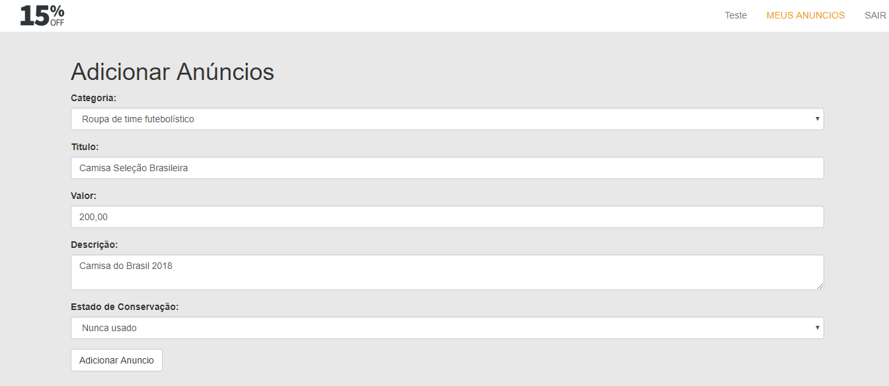
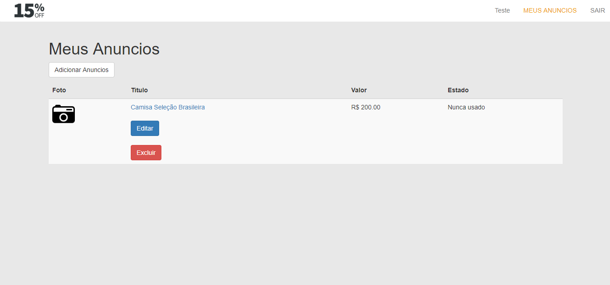
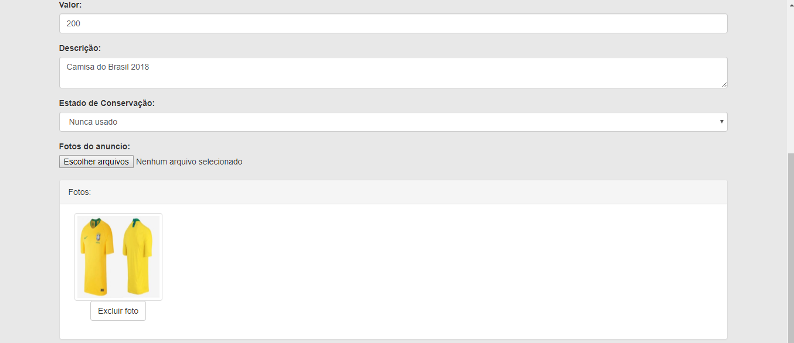
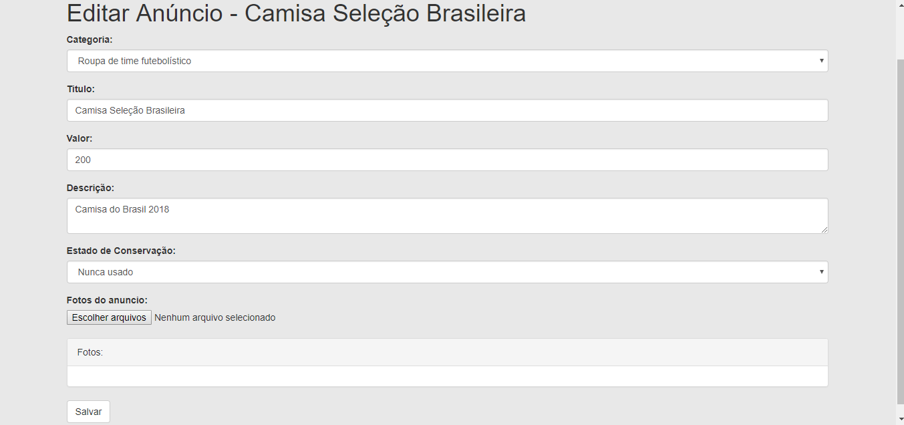
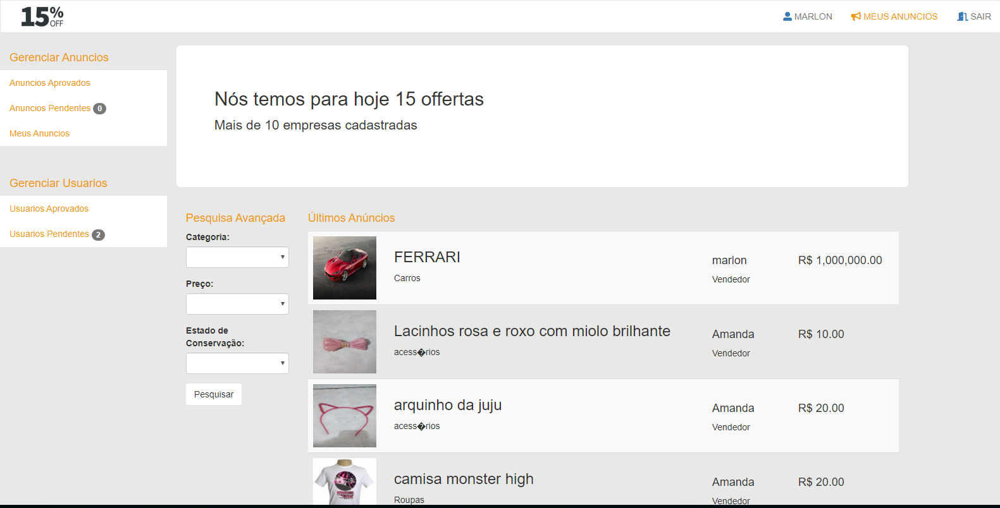
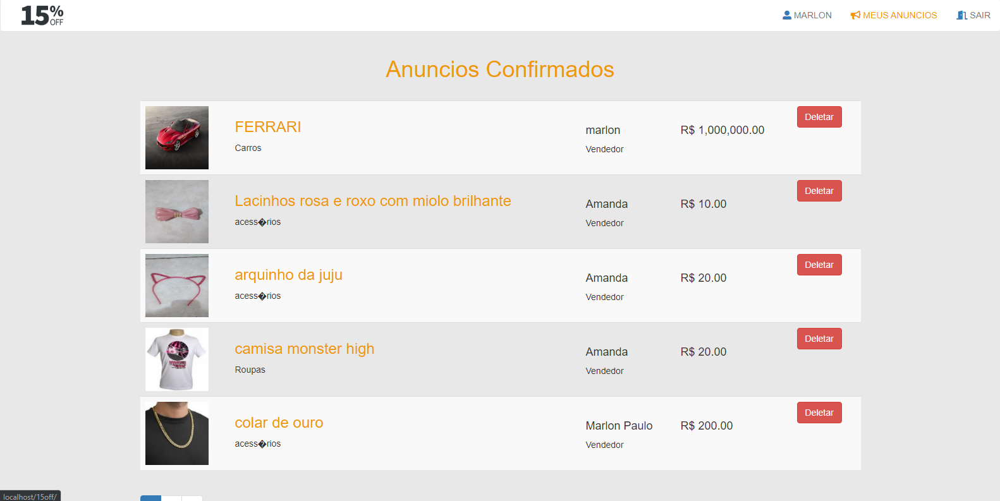

# Classificados 15off
## Para visualizar o projeto em produção [clique aqui](https://rucri.com/15off/)

### Esse Foi o projeto que fiz durante a faculdade

### Construído com: PHP e MySQL

### Site para anuncios de produtos em geral

### Notou-se que entre lojistas de varejo há uma dificuldade enorme quando em fins de temporadas ou mudanças de estação. Os lojistas necessitam se desfazer de mercadorias da estação que se finda para dar espaço às novas coleções e tendências que virão. Nossa plataforma, que decidimos chamar 15off, visa atender a esses dois públicos facilitando o contato entre eles de uma forma simples, dinâmica e extremamente útil aos dois segmentos. A plataforma 15off é um site de compra e venda de produtos de terceiros dentro das seguintes condições: produtos de fim de temporada ou fora da estação desde que exista um desconto mínimo de 15%.

### O site 15off será o canal que interligará o Usuário ao Cliente proporcionando facilidade de interação entre ambas as partes como ferramenta de negócios. O Usuário ao adentrar o ambiente do site encontrará destacado diversos produtos separados em categorias com descontos que variam de, no mínimo 15%, podendo escolher de um a vários produtos adicionando-os ao carrinho de compras.

